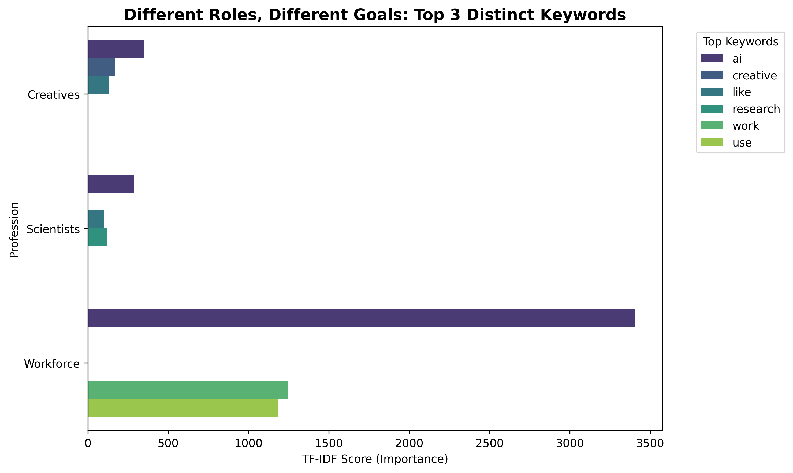

# Anthropic Interviewer Analysis Portfolio



This project provides an advanced analytical suite for the **"Anthropic Interviewer"** dataset. It goes beyond basic topic modeling to perform deep behavioral segmentation, comparative analysis across professional roles, and rigorous reliability testing.

## 🚀 Key Capabilities

### 1. Behavior Comparison (Workforce vs Creatives vs Scientists)
We implemented a comparative analysis module to contrast vocabulary and intent across different dataset splits.
*   **Scientists**: Heavy use of `research`, `data`, `process`.
*   **Creatives**: Focus on `creative`, `project`, `sounds`.
*   **Workforce**: Operations-focused terms like `tasks`, `time`, `schedule`.

### 2. "Power User" Deep Dive (Cluster 1)
Using K-Means clustering, we identified a specific user persona: **"The Architect"**.
*   **Characteristics**: High verbosity (>1000 chars/prompt), high technical score, and frequent refinement loops (26x avg).
*   **Insight**: These users treat AI as a collaborative junior developer, constantly correcting and refining outputs.

### 3. Semantic Network Analysis
Visualizes the context of key emotions (e.g., "Satisfied", "Frustrated") using a force-directed graph.
*   **Features**: Custom stop-word removal (including interview bias words), edge weighting, and KWIC (Key Word in Context) verification.

### 4. Reliability & Validity
We don't just generate charts; we validate them.
*   **Silhouette Score**: Measures clustering validity (Score: ~0.38).
*   **Reproducibility**: Enforced `random_state=42` for consistent results.

---

## 🗂 Project Structure

*   **`main.py`**: The orchestrator. Runs the full ETL pipeline, validation, and visual generation.
*   **`analysis.py`**: Core logic for TF-IDF, Clustering, and Interaction tagging.
*   **`semantic_analysis.py`**: Dedicated module for Network Analysis and Graphing.
*   **`comparative_analysis.py`**: Handles multi-split data loading and comparison.
*   **`portfolio_visuals.py`**: Generates high-quality assets for the portfolio slide.
*   **`data_loader.py`**: Interface for Hugging Face dataset loading.
*   **`TECHNICAL_REPORT.md`**: Detailed explanation of the algorithms and models used.

---

## 🛠 Installation & Usage

1.  **Install Dependencies**:
    ```bash
    pip install -r requirements.txt
    ```

2.  **Run the Analysis**:
    ```bash
    python main.py
    ```
    *Generates `analysis_report_generated.md` and all visual assets.*

3.  **Explore the Notebook**:
    ```bash
    python generate_notebook.py
    ```
    *Creates `anthropic_analysis_v2.ipynb` for interactive exploration.*

---

## 📊 Outputs
Running the analysis produces:
*   `analysis_report_generated.md`: Full insights report (Deep Dive, Stats, Validation).
*   `portfolio_comparison.png`: Key Insights Chart.
*   `portfolio_persona.png`: "The Architect" Persona Card.
*   `semantic_network.png`: Word Co-occurrence Graph.
*   `maturity_clusters.png`: User Segmentation Scatter Plot.
