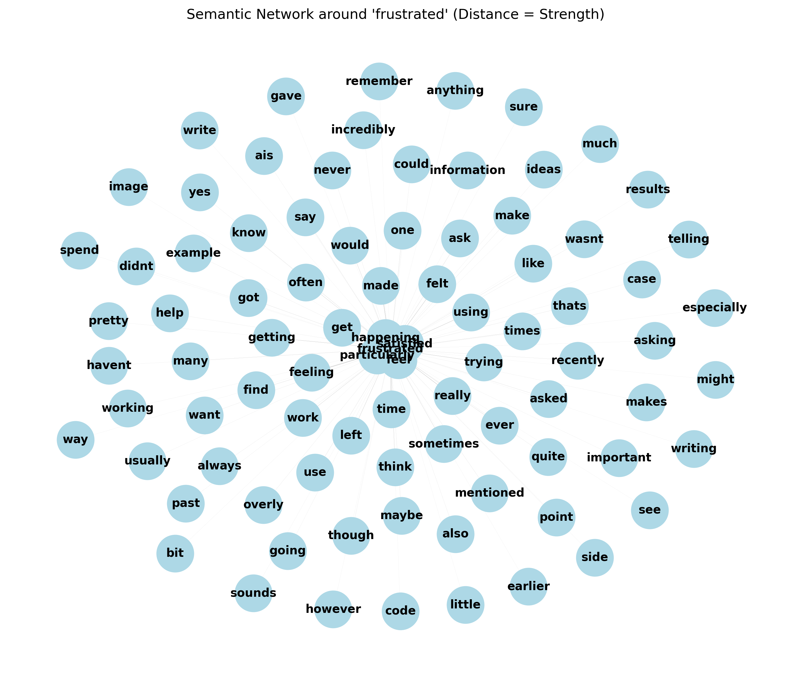
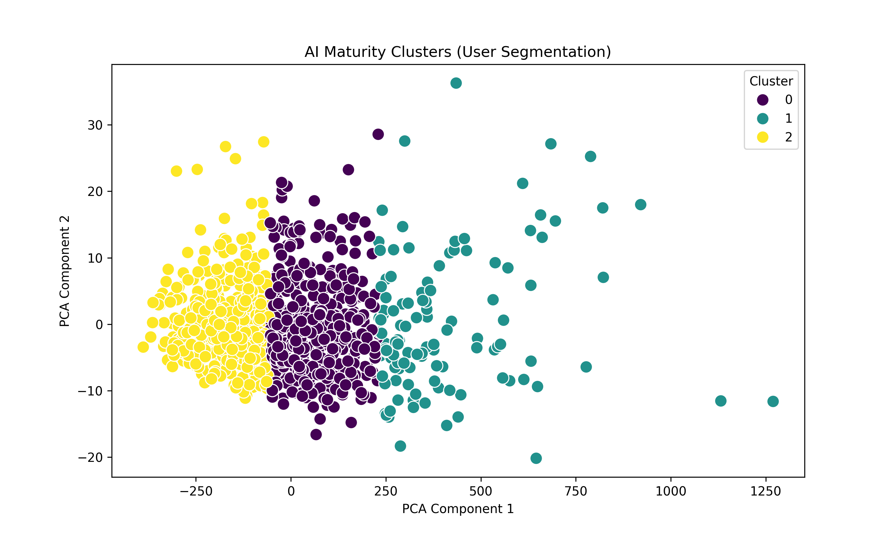

# Analysis Report: Anthropic Interviewer (Workforce Split)

## 1. Topic & Use Case Analysis
Top TF-IDF Terms in User Prompts (Potential Tasks):
| term     |     rank |
|:---------|---------:|
| ai       | 3404.79  |
| work     | 1244.79  |
| use      | 1181.31  |
| like     | 1053.23  |
| tasks    |  917.802 |
| really   |  863.7   |
| time     |  830.32  |
| using    |  783.559 |
| think    |  770.973 |
| sounds   |  668.026 |
| ve       |  607.936 |
| help     |  598.156 |
| tell     |  567.529 |
| let      |  511.835 |
| research |  509.893 |
| great    |  506.602 |
| makes    |  502.596 |
| way      |  498.656 |
| just     |  495.512 |
| human    |  490.23  |

## 2. Interaction Patterns
| interaction_type | count |
| --- | --- |
| delegation | 1391 |
| collaboration | 980 |
| foundation | 1220 |
| total_user_turns | 12076 |

## 3. Trust & Limitations
- **Total User Turns Analyzed**: 12076
- **Turns with Error/Hallucination Keywords**: 1043
- **Percentage**: 8.64%

## 4. Future Outlook & Skills
Found 3889 mentions regarding career/skills/future.

### Sample Quotes (First 10):
- > "I gave a lot of details in this specific scenario. I provided as much details as possible and I noticed it really made a difference. I also included information about myself and my personality to help..."
- > "I think I will continue to use it the way I have. I hope in the future, the AI will improve and thus improve my performance at work as well.  AI: Those are all the questions I had prepared. You've sha..."
- > "I use AI sparingly at my job. I only use it to make sure that my grammar and spelling are correct on the emails I send to clients.  AI: Tell me more about that. What made you decide to use AI specific..."
- > "I use Grammarly primarily. I'd been asked to use it for a task at a part time job at one point and, after trying it out, I found it superior to my computer's normal spell/grammar check. Grammarly catc..."
- > "Sure. It's important that my clients can understand what I'm talking about, but also that I state things in a way that keeps me as safe from litigation as possible. The templates I use are based on wh..."
- > "Usually it just stops working in one application, like when I'm writing an email. Either I just send the email as is, or I transfer it to something else, like a Google Doc, use Grammarly there, and th..."
- > "well the deciding factor for me is, if Im spending three tries trying to get the AI to deliver what I want and then having to worry about my specific prompting, even when I am very explicit and direct..."
- > "I think the spreadsheet example I gave earlier stood out to me because that was particularly frustrating. If Im doing a lot of spreadsheet work, I tend to just educate myself for the specific task at ..."
- > "Yes I do consider that. And thats a very important thing. I think we have reached a level of complexity in technology that It may be long past that point. What I mean by that is, I belive there are es..."
- > "I think AI has great potential within the workplace specifically for smaller or independent businesses where it could serve as a means to accomplish tasks where workers or owners may lack skillset. I ..."

## 5. Advanced Analysis (Diagnostic & Predictive)

### 5.1 Semantic Network Analysis
Generated network graph centered around **'frustrated'**.

### 5.2 AI Maturity Matrix (Clustering)
Performed K-Means clustering (k=3) based on verbosity, complexity, refinement frequency, and technical terms.

**Cluster Centroids (Average Feature Values):**
| Cluster | Avg Length | Complexity | Refinement Count | Tech Score |
| --- | --- | --- | --- | --- |
| 0 | 745.57 | 0.40 | 17.51 | 4.08 |
| 1 | 1095.39 | 0.38 | 26.07 | 5.83 |
| 2 | 522.17 | 0.42 | 13.24 | 2.94 |