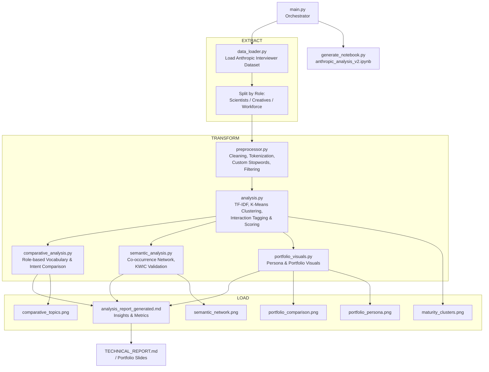

# 🛠️ Technical Report: Fundamental Code & Models
**Project**: Anthropic Interview Analysis
**Domain**: NLP, User Behavior Analysis, Data Visualization

---

## 1. Fundamental Code Structure (System Architecture)

The project uses a modular **ETL (Extract, Transform, Load)** architecture implemented in Python 3.10+. Below is the detailed breakdown of the system flow.

### 1.1 Diagram Alur Tingkat Tinggi (End-to-End)

**Extract**
*   **`data_loader.py`**: 
    *   Load dataset "Anthropic Interviewer" dari Hugging Face.
    *   Split per role: Scientists, Creatives, Workforce.
    *   Menghasilkan objek data mentah terstruktur (DataFrame / list of dict).

**Transform**
*   **`preprocessor.py`**:
    *   Pembersihan teks (lowercasing, remove symbols, dsb.).
    *   Tokenization dan stop-word removal (termasuk custom stopwords untuk interview-bias).
    *   Filtering panjang teks, normalisasi fitur, dll.
*   **`analysis.py`**:
    *   TF-IDF vectorization.
    *   K-Means clustering → user segmentation (maturity clusters).
    *   Tagging interaksi, scoring (verbosity, refinement loops, technical score).
*   **`comparative_analysis.py`**:
    *   Analisis perbandingan vocabulary dan intent antar role (Scientists / Creatives / Workforce).
    *   Perhitungan metrik per role dan pembuatan ringkasan komparatif.
*   **`semantic_analysis.py`**:
    *   Perhitungan co-occurrence dan edge weighting.
    *   Pembangunan semantic network (graph emosi/intent).
    *   Validasi dengan KWIC (Key Word in Context).
*   **`portfolio_visuals.py`**:
    *   Konsolidasi hasil analisis ke bentuk visual.
    *   Pembuatan chart untuk persona, perbandingan portfolio, dan cluster.

**Load**
*   **`main.py`**:
    *   Mengorkestrasi seluruh pipeline ETL & analisis.
    *   Menyimpan output:
        *   `analysis_report_generated.md` (laporan otomatis).
        *   File visual: `portfolio_comparison.png`, `portfolio_persona.png`, `semantic_network.png`, `maturity_clusters.png`, `comparative_topics.png`.
    *   Opsional: menghasilkan notebook via `generate_notebook.py`.

### 1.2 Diagram Flowchart



### 1.3 Versi Sederhana (Untuk Slide Presentasi)

```mermaid
flowchart LR

    D[Dataset Anthropic Interviewer<br/>(Hugging Face)] 
        --> DL[data_loader.py<br/>Load & Split Roles]
        --> PP[preprocessor.py<br/>Text Cleaning & Tokenization]
        --> AN[analysis.py<br/>TF-IDF & Clustering]

    AN --> CA[comparative_analysis.py<br/>Role Comparison]
    AN --> SA[semantic_analysis.py<br/>Semantic Network]
    AN --> PV[portfolio_visuals.py<br/>Portfolio & Persona Visuals]

    CA --> OUT[analysis_report_generated.md]
    SA --> OUT
    PV --> OUT

    OUT --> FINAL[Technical Report & Visual Portfolio]
```

### 1.4 Label Fase ETL

| Fase | Modul / Script | Fungsi Utama |
| :--- | :--- | :--- |
| **Extract** | `data_loader.py` | Load dataset, split per role |
| **Transform** | `preprocessor.py` | Cleaning, tokenization, custom stopwords |
| **Transform** | `analysis.py` | TF-IDF, clustering, tagging, scoring |
| **Transform** | `comparative_analysis.py` | Role-based comparison |
| **Transform** | `semantic_analysis.py` | Semantic network, KWIC |
| **Transform** | `portfolio_visuals.py` | Pembuatan seluruh visual portfolio |
| **Load** | `main.py` + writer | Generate laporan .md & file .png |

---

## 2. Analytical Models Used

### 2.1 Term Frequency-Inverse Document Frequency (TF-IDF)
*   **Purpose**: Topic Modeling.
*   **Why**: Unlike simple word counts, TF-IDF reduces the weight of common English words (the, a, is) and highlights unique, meaningful terms for each user group.
*   **Implementation**: `TfidfVectorizer(stop_words='english', max_features=100)`.

### 2.2 Semantic Network Analysis (Co-occurrence Graph)
*   **Purpose**: Understanding context around specific keywords (e.g., "Satisfied").
*   **Method**: 
    1.  **Sliding Window**: Scans text 5 words left/right of the target.
    2.  **Filtering**: Removes stops and short words (<4 chars).
    3.  **Graphing**: Nodes = Words, Edges = Co-occurrences.
    4.  **Layout**: Fruchterman-Reingold force-directed algorithm (`spring_layout`). 
    *   *Note*: Custom physics (`k=15.0`) were applied to prevent node overlaps.

### 2.3 K-Means Clustering
*   **Purpose**: User Segmentation (Behavioral Persona).
*   **Features Used**:
    1.  **Verbosity**: Average character length per turn.
    2.  **Complexity**: Vocabulary richness (Unique words / Total words).
    3.  **Refinement Rate**: Frequency of corrective keywords ('wrong', 'change').
    4.  **Tech Score**: Frequency of technical jargon ('code', 'api').
*   **Algorithm**: Unsupervised K-Means with `n_clusters=3`.
*   **Result**: Identified 3 distinct groups (Casuals, Pragmatists, Power Users).

### 2.4 Sentiment & Interaction Tagging (Rule-Based)
*   **Purpose**: Quantifying abstract concepts like "Trust" or "Delegation".
*   **Method**: Dictionary-based pattern matching.
    *   *Delegation*: "draft", "generate", "write".
    *   *Hallucination/Trust*: "wrong", "false", "error".
*   **Why**: Rule-based systems are often more reliable than LLM-judges for specific keyword density analysis in technical domains.

---

## 3. Reliability & Validity
*   **Silhouette Score**: Used to validate cluster separation (Result: ~0.38, indicating fair structure).
*   **KWIC (Key Word In Context)**: Manual spot-checks to ensure semantic edges represent true linguistic relationships.
*   **Reproducibility**: `random_state=42` enforced across all nondeterministic algorithms.
